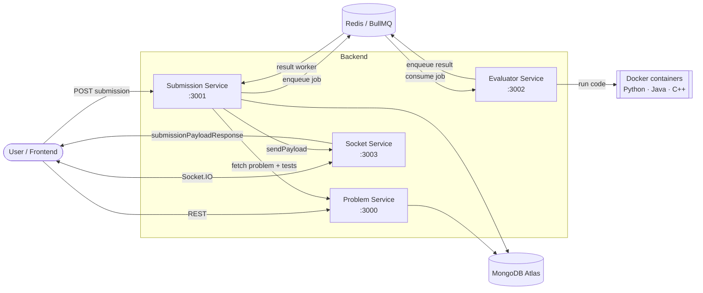

# LetsCode Backend

Microservices backend for **LetsSolve** — a coding practice platform where users solve problems, submit code, and receive real-time evaluation results.

## Architecture



## Services

| Service | Stack | Description |
|---------|-------|-------------|
| [lets-solve-problem-service](./lets-solve-problem-service) | Express, MongoDB | Admin API to create and manage coding problems |
| [letsSolve-submission-service](./letsSolve-submission-service) | Fastify, MongoDB, BullMQ | Accepts code submissions and orchestrates evaluation |
| [LetsCode-Evaluator-Service](./LetsCode-Evaluator-Service) | TypeScript, Express, Docker, BullMQ | Runs submitted code in isolated containers |
| [letsCode-Socket-Service](./letsCode-Socket-Service) | Express, Socket.IO, Redis | Pushes evaluation results to clients in real time |

## Prerequisites

- Node.js 18+
- MongoDB (local or Atlas)
- Redis
- Docker (required for the Evaluator Service)

## Getting Started

Each service runs independently. Clone the repo, then set up and start each service in its own directory.

### 1. Problem Service

```bash
cd lets-solve-problem-service
npm install
```

Create a `.env` file:

```env
PORT=3000
ATLAS_DB_URL=<mongodb-connection-string>
LOG_DB_URL=<mongodb-log-db-url>   # optional
```

```bash
npm run dev
```

Optionally seed starter problems:

```bash
npm run seed
```

Health check: `GET /ping`

### 2. Submission Service

```bash
cd letsSolve-submission-service
npm install
```

Create a `.env` file:

```env
PORT=3001
ATLAS_DB_URL=<mongodb-connection-string>
REDIS_HOST=127.0.0.1
REDIS_PORT=6379
PROBLEM_ADMIN_SERVICE_URL=http://localhost:3000
```

```bash
npm run dev
```

API: `POST /api/v1/submissions`

### 3. Evaluator Service

```bash
cd LetsCode-Evaluator-Service
npm install
```

Create a `.env` file:

```env
PORT=3002
REDIS_HOST=127.0.0.1
REDIS_PORT=6379
```

```bash
npm run dev
```

API: `POST /api/v1/submission`

### 4. Socket Service

```bash
cd letsCode-Socket-Service
npm install
npm run dev   # listens on port 3003
```

## API Overview

### Problem Service (`/api/v1/problems`)

| Method | Endpoint | Description |
|--------|----------|-------------|
| GET | `/` | List all problems |
| GET | `/:id` | Get a problem by ID |
| POST | `/` | Create a problem |
| PUT | `/:id` | Update a problem |
| DELETE | `/:id` | Delete a problem |

### Submission Service (`/api/v1/submissions`)

| Method | Endpoint | Description |
|--------|----------|-------------|
| POST | `/` | Submit code for evaluation |

### Evaluator Service (`/api/v1`)

| Method | Endpoint | Description |
|--------|----------|-------------|
| GET | `/ping` | Health check |
| POST | `/submission` | Queue a submission for evaluation |

## Supported Languages

- Python
- Java
- C++ (partial support)

## Project Structure

```
LetsCodeBackend/
├── lets-solve-problem-service/   # Problem CRUD & test cases
├── letsSolve-submission-service/ # Submission handling & queueing
├── LetsCode-Evaluator-Service/   # Code execution via Docker
└── letsCode-Socket-Service/      # Real-time result delivery
```

## License

ISC
